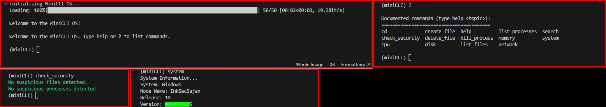

# SysCLI Project



SysCLI is a command-line tool for displaying system information and managing system processes. It provides various functionalities such as checking system information, managing processes, running security checks, performing web searches, and more.

## Installation

To install the package, use:

```sh
pip install .
Usage
After installation, you can run the CLI tool using:

sh
Copy code
mycli
If running directly from the source code, use:

sh
Copy code
python main.py
Features
Display System Information
Shows basic details about the system such as OS, node name, release, version, machine, and processor.

Command:

sh
Copy code
system
Display CPU Information
Provides details about the CPU, including physical cores, total cores, frequency, and usage per core.

Command:

sh
Copy code
cpu
Display Memory Information
Shows information about total, available, used memory, and memory percentage.

Command:

sh
Copy code
memory
Display Disk Information
Lists disk partitions and usage statistics.

Command:

sh
Copy code
disk
Display Network Information
Displays network interfaces and their associated IP addresses and MAC addresses.

Command:

sh
Copy code
network
List All Running Processes
Lists all running processes with their PID, name, and status.

Command:

sh
Copy code
list_processes
Kill a Process by its PID
Allows termination of a process by specifying its PID.

Command:

sh
Copy code
kill_process <PID>
Check Files and Processes for Common Security Risks
Scans for suspicious files and processes that may indicate security issues.

Command:

sh
Copy code
check_security
List Files and Directories
Lists files and directories in the current directory or specified path.

Command:

sh
Copy code
list_files <path>
Change the Current Working Directory
Changes the current working directory to a specified path.

Command:

sh
Copy code
cd <path>
Create and Delete Files
Provides commands to create and delete files.

Commands:

sh
Copy code
create_file <filename>
delete_file <filename>
Perform Web Searches
Uses Google Custom Search to perform web searches from the CLI.

Command:

sh
Copy code
search <query>
Logging
Command executions are logged in the miniCLI.log file for auditing and troubleshooting purposes.